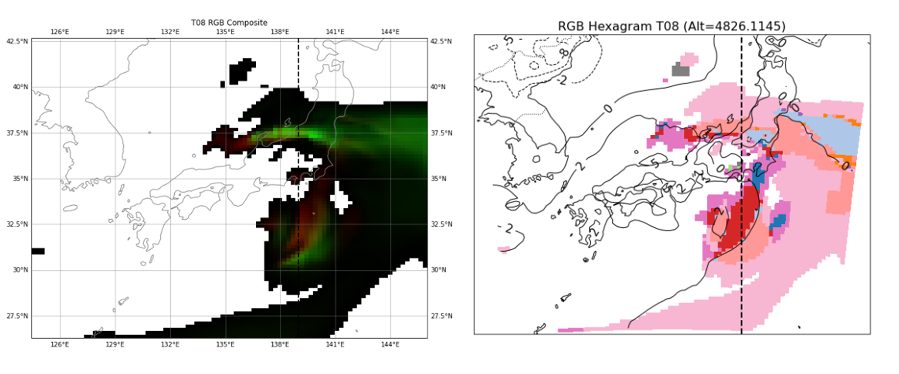

# RGB Hexagram (Kondo 2025) application to simulation results using a cloud-resolving model
## Introduction
This software provides sample source code as a tutorial for applying the RGB (Red, Green, and Blue) hexagram, a visualization and multivariate analysis method, to simulation results using a cloud-resolving model.
The visualization and multivariate analysis using RGB hexagram can apply to general cloud-resolving model, although the cloud-resolving model: [SCALE](https://scale.riken.jp) (Scalable Computing for Advanced Library and Environment, Nisizawa et al. 2015; Sato et al. 2015) in this tutorial.

The supported languages are now Python and fortran.  If you are a fortran user and you want to use fortran codes, please contact me with the e-mail address in [ORCID](https://orcid.org/0000-0003-4434-7877).

Please see [Kondo (2025)](https://doi.org/10.2151/sola.2025-028) for details of the visualization and multivariate analysis method.


## Preparation
The simulation results used in this repository are based on the “3.2 Real Atmospheric Case” tutorial provided in the documentation of cloud-resolving model SCALE. In this tutorial, simulation outputs corresponding to liquid water, graupel, ice, and temperature are used as the 3-components of RGB values. </br>
For this analysis, NetCDF data generated using two different cloud microphysics schemes (1-moment bulk scheme: Tomita 2008; `data/merged-z_history_d01_t08.pe000000.nc`, 2-moment bulk scheme: Seiki and Nakajima 2014; `data/merged-z_history_d01_sn14.pe000000.nc`) were utilized.

```
├── LICENSE
├── README.md
├── README_jp.md
├── RGB_hexagram_tutorial_for_SCALE_comparison.ipynb
├── images_crm
│   └── RGB_hexagram_Area_analysis_CRM.png
└── sample_simulation_data
    ├── merged-z_history_d01_sn14.pe000000.nc
    └── merged-z_history_d01_t08.pe000000.nc
```

## Workflow
The overall procedure follows the same approach as the analysis of 5-dimensional data. In addition, this workflow incorporates visualization using RGB values and analysis based on the Area information on the RGB hexagram.

The RGB hexagram is enable us to get two major findings of this simulation dataset:
1. Visualization of the composition of mixed-phase cloud areas using RGB-based color representation
2. Characterization of mixed-phase cloud areas based on the Area information on the RGB hexagram

These analyses are effective in enhancing our understanding of key characteristics of clouds.



## Future Prospects for the Application of the RGB Hexagram
The RGB hexagram approach can be effectively applied to arbitrary variables within any dataset. Moreover, if common variables are used across different models or schemes, it is possible to perform visualization and analysis using a shared RGB hexagram across multiple datasets.

