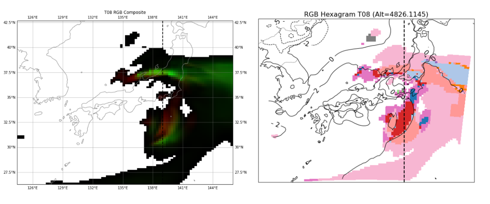

# RGBヘキサグラム(Kondo 2025)の気象モデルによる数値シミュレーション結果への適用
## 概要
このJupyter NotebookではRGB (Red, Green, and Blue)ヘキサグラムを用いて気象モデルのシミュレーション結果の可視化・多変量解析を行うチュートリアルを示します。
RGBヘキサグラムを用いた可視化・多変量解析はあらゆる気象モデルに適用可能です。このチュートリアルは気象モデルのひとつである [SCALE](https://scale.riken.jp) (Scalable Computing for Advanced Library and Environment, Nisizawa et al. 2015; Sato et al. 2015)による計算結果を用いて行います。
このチュートリアルではPythonを用います。もしfortranユーザの方でコードを使いたい方は[ORCID](https://orcid.org/0000-0003-4434-7877)からご連絡ください。

可視化・多変量解析の詳細につきましては[Kondo (2025)](https://doi.org/10.2151/sola.2025-028) をご覧ください。


## 事前準備
本チュートリアルで用いるシミュレーション結果は気象モデルSCALEのチュートリアル資料における「[現実大気実験](https://scale.riken.jp/archives/scale_users_guide.v5.5.4.pdf)」の結果を用います。本チュートリアルではRGBヘキサグラムに用いるRGB値の3変数に液水・霰・氷を、鉛直軸に気温を用いました。 </br>
解析にはSCALEに実装されている2種類の雲微物理スキーム (1-moment bulk scheme: Tomita 2008; `data/merged-z_history_d01_t08.pe000000.nc`, 2-moment bulk scheme: Seiki and Nakajima 2014; `data/merged-z_history_d01_sn14.pe000000.nc`) によるNetCDFデータを用いました。

```
├── LICENSE
├── README.md
├── README_jp.md
├── RGB_hexagram_tutorial_for_SCALE_comparison.ipynb
├── images_crm
│   └── RGB_hexagram_Area_analysis_CRM.png
└── sample_simulation_data
    ├── merged-z_history_d01_t08.pe000000.nc
    └── merged-z_history_d01_sn14.pe000000.nc
```

## 作業手順
全体的な解析手順は5次元データを用いたRGBヘキサグラムのチュートリアルと同様です。本チュートリアルではRGBヘキサグラムの活用としてRGB値を用いた可視化とRGBヘキサグラム上のArea情報を用いた可視化を示します。

本チュートリアルではRGBヘキサグラムを数値シミュレーション結果に適用することで以下の2つの知見を得ることができます:
1. RGB値による混相域の構造の可視化
2. RGBヘキサグラムの各Area情報に基づく混相域の特徴づけ

このような解析は雲の重要な特性の理解にとても効果的だと考えられます。



## RGBヘキサグラムの今後の展望
### RGBヘキサグラムによる解析は、あらゆるデータセット内の任意の変数に効果的に適用できます。 さらに、異なるモデルやスキーム間で共通の変数が使用されている場合、複数のデータセット間で共有されたRGBヘキサグラムを使用して視覚化と分析を実行することが可能です。

